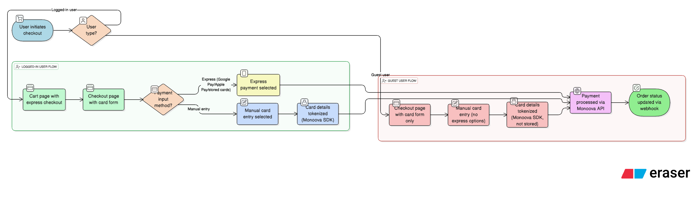
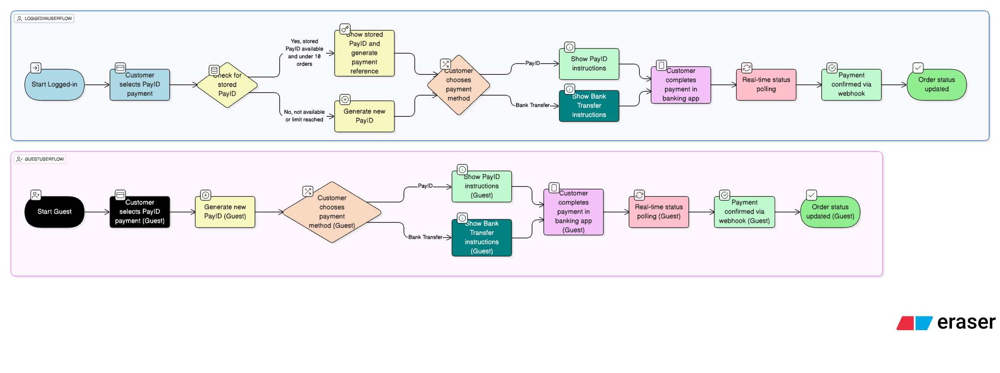
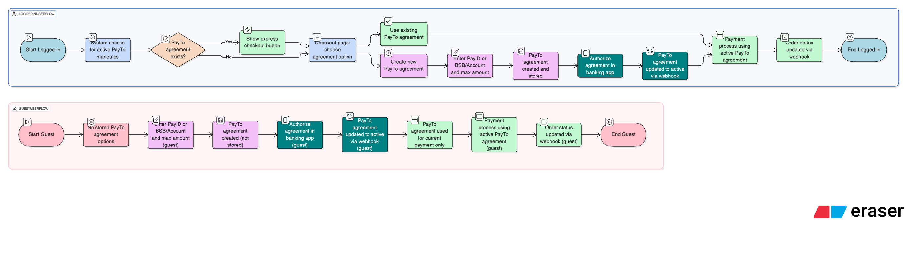

# Monoova Payments for WooCommerce

**Contributors:** Monoova
**Tags:** woocommerce, payments, gateway, monoova, payid, payto, npp, credit card, direct debit, subscriptions
**Requires at least:** WooCommerce 6.1
**Tested up to:** WooCommerce 8.0.0
**Requires PHP:** 7.2
**Stable tag:** 1.0.7
**License:** GPLv2 or later
**License URI:** https://www.gnu.org/licenses/gpl-2.0.html

Accept secure payments using Monoova's Card, PayID, PayTo, direct bank transfers, Apple Pay, and Google Pay.

## Description

This plugin provides a comprehensive integration between WooCommerce and Monoova, allowing you to accept a variety of payment methods directly on your store. It leverages Monoova's robust APIs for secure and reliable payment processing. The PayTo gateway includes full support for WooCommerce Subscriptions with automated mandate management. The plugin supports both traditional checkout and the modern WooCommerce block-based checkout experience.

### Key Features:

*   **Card Payments:** Accept major credit and debit cards with Monoova SDK integration
*   **PayID Payments:** Offer PayID and direct bank transfers for Australian customers
*   **PayTo Payments:** Support for PayTo mandates with automatic recurring payments
*   **Express Checkout:** Quick payment options including Apple Pay, Google Pay, and PayTo Express
*   **WooCommerce Subscriptions:** Full subscription support for PayTo payment method
*   **Mandate Management:** Automated PayTo mandate creation and management for subscriptions
*   **Block Checkout:** Seamless integration with WooCommerce Blocks for modern checkout experience
*   **Real-time Updates:** Live transaction status updates for PayID and PayTo payments
*   **Admin Dashboard:** Centralized dashboard to view transaction history, mandate status, and refund information
*   **Webhook Integration:** Secure webhook handling for payment status synchronization
*   **Flexible Configuration:** Customizable checkout experience with multiple payment options

## Installation

### Prerequisites

*   WordPress 6.0 or higher
*   WooCommerce 6.1 or higher
*   PHP 7.2 or higher
*   A Monoova account (mAccount, API Key)
*   WooCommerce Subscriptions plugin (optional, for subscription features)

### Setup and Installation

1.  **Download the plugin:** Download the latest version of the plugin as a ZIP file.
2.  **Install the plugin:**
    *   In your WordPress admin dashboard, navigate to `Plugins` > `Add New`.
    *   Click `Upload Plugin` and choose the ZIP file you downloaded.
    *   Click `Install Now` and then `Activate Plugin`.
3.  **Configure the plugin:**
    *   Navigate to `WooCommerce` > `Settings` > `Payments`.
    *   You will see different Monoova payment methods (Card, PayID, PayTo, Unified).
    *   Click `Manage` on the Unified payment gateway to configure all required settings for Monoova accounts, Webhooks connection, and payment methods (Card, PayID, and PayTo)
    *   Enter your Monoova API credentials and configure the settings as needed.

### Payment Gateway Configuration

The plugin provides four main payment gateways:

#### 1. Monoova Card Gateway (`monoova_card`)
- **Purpose:** Credit/Debit card payments with Monoova SDK
- **Features:** Tokenization, Apple Pay, Google Pay
- **Configuration:**
  - API credentials (mAccount, API Key)
  - Monoova SDK settings
  - Express checkout options (Apple Pay/Google Pay)

#### 2. Monoova PayID Gateway (`monoova_payid`)
- **Purpose:** PayID and bank transfer payments
- **Features:** Real-time status polling, QR codes, multiple payment types
- **Configuration:**
  - Static PayID or bank account details
  - Payment types (PayID, Bank Transfer, or both)
  - Reference field display options
  - Payment instructions customization

#### 3. Monoova PayTo Gateway (`monoova_payto`)
- **Purpose:** PayTo mandate-based payments with WooCommerce Subscriptions support
- **Features:** Mandate management, Express checkout, Subscription support
- **Configuration:**
  - PayTo API credentials
  - Mandate settings (expiry, transaction maximum amount)
  - Express checkout for existing mandates
  - WooCommerce Subscriptions integration settings

#### 4. Monoova Unified Gateway (`monoova_unified`)
- **Purpose:** Centralized configuration for all payment methods
- **Features:** Single settings interface, child gateway management
- **Configuration:**
  - Master API credentials
  - Global settings for all above payment methods
  - Child gateway visibility control

## For Developers

### Dependencies and Build Process

This project uses `npm` to manage JavaScript dependencies and `@wordpress/scripts` for building assets.

1.  **Install Dependencies:**
    Navigate to the plugin's root directory in your terminal and run:
    ```bash
    npm install
    ```

2.  **Build for Production:**
    To compile and minify the JavaScript and CSS assets for production, run:
    ```bash
    npm run build
    ```

3.  **Development Mode:**
    To watch for changes in asset files and automatically rebuild them during development, run:
    ```bash
    npm run start
    ```

### Source Code Structure

The plugin is organized into the following structure:

```
/
|-- assets/                 # Frontend assets
|   |-- css/                # Compiled CSS files
|   |-- images/             # Plugin images and logos
|   |-- js/                 # JavaScript files
|       |-- build/          # Compiled JS files (auto-generated)
|       |-- src/            # Source JS files
|           |-- admin/      # Admin-specific JS
|           |-- blocks/     # WooCommerce blocks integration JS
|           |-- hooks/      # Custom React hooks
|
|-- includes/               # Backend PHP classes
|   |-- admin/              # Admin-related classes and views
|   |   |-- views/          # Admin dashboard and settings page templates
|   |-- api/                # API communication classes
|   |-- blocks/             # WooCommerce blocks integration classes
|   |-- class-monoova-*.php # Core gateway and handler classes
|
|-- templates/              # Frontend templates
|   |-- checkout/           # Checkout-related templates
|
|-- monoova-payments-for-woocommerce.php # Main plugin file
|-- package.json            # NPM dependencies and scripts
|-- template-primer-redirect.php # Redirect page template for Monoova checkout SDK
|-- webpack.config.js       # Webpack configuration
```

### Key Files and Classes

#### Core Gateway Classes
- `class-monoova-gateway.php` - Abstract base class for all payment gateways
- `class-monoova-card-gateway.php` - Card payment gateway with Monoova SDK integration
- `class-monoova-payid-gateway.php` - PayID/Bank transfer payment gateway
- `class-monoova-payto-gateway.php` - PayTo mandate-based payment gateway
- `class-monoova-unified-gateway.php` - Unified configuration gateway
- `class-monoova-payto-mandate-manager.php` - PayTo mandate management system

#### API and Integration
- `api/class-monoova-api.php` - Monoova API client and communication layer
- `class-monoova-webhook-handler.php` - Webhook processing for payment status updates
- `class-monoova-subscriptions.php` - WooCommerce Subscriptions integration

#### Block Integrations
- `blocks/class-monoova-*-blocks-integration.php` - WooCommerce Blocks payment method registrations
- `assets/js/src/blocks/monoova-*-block.js` - Frontend block implementations

## Architecture

The plugin is built on a modular architecture, separating concerns for maintainability and extensibility.

### Core Components

*   **Main Plugin File (`monoova-payments-for-woocommerce.php`):** The entry point of the plugin. It handles initialization, hooks, and loading of all other files.

*   **Gateway Classes (`includes/class-monoova-*-gateway.php`):** Each payment method is implemented as a separate WooCommerce payment gateway class:
    - **Unified Gateway:** Provides centralized configuration for all payment methods
    - **Card Gateway:** Handles credit/debit card payments with Monoova SDK integration
    - **PayID Gateway:** Manages PayID and bank transfer payments with real-time polling
    - **PayTo Gateway:** Processes PayTo mandate-based payments with subscription support
    

*   **API Layer (`includes/api/class-monoova-api.php`):** A dedicated class that abstracts all communication with the Monoova APIs. This provides a single point of contact for making API requests to different Monoova endpoints.

*   **Mandate Management (`includes/class-monoova-payto-mandate-manager.php`):** Handles PayTo mandate storage, retrieval, and lifecycle management in WordPress database.

*   **Block Integrations (`includes/blocks/` & `assets/js/src/blocks/`):** These files handle the integration with the WooCommerce block-based checkout. Each payment method has:
    - PHP class to register the payment method type
    - JavaScript file to render the payment method interface
    - Express checkout variants for quick payments (Card or PayTo)

*   **Subscription Integration (`includes/class-monoova-subscriptions.php`):** Handles WooCommerce Subscriptions integration following the official 6-step developer guide.

*   **Webhook Handler (`includes/class-monoova-webhook-handler.php`):** A class responsible for processing incoming webhooks from Monoova to update order statuses in real-time.

*   **Admin Interface (`includes/admin/`):** Manages the plugin's admin-facing features, including:
    - Settings pages with React-based configuration
    - Reporting dashboard with transaction statistics
    - Mandate management interface

*   **Frontend Scripts:** JavaScript files in `assets/js/src/` handle client-side interactions:
    - Monoova SDK integration for card payments
    - AJAX polling for PayID payment status
    - PayTo mandate creation and management
    - Express checkout implementations

### Technologies and Tools

*   **Backend:** PHP
*   **Frontend:** JavaScript (ES6+), React.js, SCSS
*   **Build Tools:** Webpack, Babel (via `@wordpress/scripts`)
*   **Dependencies:**
    *   `@wordpress/scripts`: For building and bundling assets.
    *   `@wordpress/element`: WordPress abstraction for React.
    *   `@wordpress/data`: For state management in the block editor.
    *   `jquery`: For legacy parts of WooCommerce and AJAX.
*   **External Services:**
    *   **Monoova Card SDK:** The card payment flow is integrated with the Monoova SDK for a secure and unified checkout experience.

## Payment Flows and Use Cases

### Card Payment Flow



**Card Payment Process:**

#### For Logged-in Users:
1. Customer selects card payment method
2. **Cart Page:** Express checkout buttons available
3. **Checkout Page:** a built-in card form available after selecting payment method as "Card"
4. Customer can choose express payment (Google Pay/Apple Pay/stored cards) or manual card entry
5. Card details tokenized by Monoova SDK (if manual entry)
6. Payment processed through Monoova API
7. Order status updated based on payment result (via webhooks)

#### For Guest Users:
1. Customer selects card payment method
2. **No express checkout options** - card form only
3. Customer enters card details manually
4. Card details tokenized by Monoova SDK but not stored
5. Payment processed through Monoova API
6. Order status updated based on payment result (via webhooks)

### PayID Payment Flow



**PayID Payment Process:**

#### For Logged-in Users:
1. Customer selects PayID payment method in the checkout page
2. **System checks for stored PayID details** from previous transactions (reuse one PayID for up to 10 orders)
3. If stored PayID available, shows stored PayID with a new generated payment reference
4. Customer can choose to use PayID or Bank Transfer
5. System displays appropriate payment instructions
6. Customer completes payment in their banking app
7. Real-time status polling begins (every 10s)
8. Order status updated when payment confirmed (via webhooks)

#### For Guest Users:
1. Customer selects PayID payment method
2. **No stored payment options** - new payment only (generates new PayID for each order)
3. Customer chooses between PayID or Bank Transfer
4. System displays appropriate payment instructions
5. Customer completes payment in their banking app
6. Real-time status polling begins (every 10s)
7. Order status updated when payment confirmed (via webhooks)

### PayTo Payment Flow



**PayTo Payment Process:**

#### For Logged-in Users:
1. Customer selects PayTo payment method
2. **System checks for existing active PayTo mandates**
3. If PayTo agreement exists, shows **express checkout button on cart page**
4. In checkout page, customer can choose to:
   - **Use existing PayTo agreement** for quick payment
   - **Create new PayTo agreement** (deactivates existing ones)
5. If creating new PayTo agreement, customer chooses PayID or BSB/Account and enters a maximum amount
6. PayTo agreement is created and stored for future use
7. Customer authorizes the PayTo agreement in their banking app
8. PayTo agreement is updated to active status via webhook
7. Payment process using the active PayTo agreement
9. Order status updated based on payment result (via webhooks)


#### For Guest Users:
1. Customer selects PayTo payment method
2. **No stored PayTo agreement options** - new PayTo agreement creation only
3. Customer chooses PayID or BSB/Account for PayTo agreement and enters a maximum amount
4. PayTo agreement created but **not stored for future use**
5. Customer authorizes the PayTo agreement in their banking app
6. PayTo agreement updated to active status via webhook
7. PayTo agreement is used for the current payment only
8. Payment process using the active PayTo agreement
9. Order status updated based on payment result (via webhooks)


## WooCommerce Subscriptions Integration

The PayTo gateway provides full integration with WooCommerce Subscriptions following the official 6-step developer guide:

### Supported Features (PayTo Only)
- **Automatic Recurring Payments:** PayTo mandates enable seamless subscription renewals
- **Payment Method Changes:** Customers can update their PayTo mandates
- **Subscription Cancellation:** Proper cleanup of PayTo mandates
- **Failed Payment Handling:** Retry logic and customer notifications for PayTo payments
- **Proration Support:** Handles subscription upgrades/downgrades with PayTo
- **Multiple Subscriptions:** Support for multiple active subscriptions per customer using PayTo

### PayTo Subscription Flow
1. **Initial Subscription:** PayTo mandate created with subscription details
2. **Recurring Payments:** Automatic payments using stored mandate
3. **Mandate Management:** Mandates linked to subscription lifecycle
4. **Express Checkout:** Existing mandate holders get quick subscription signup

### Note on Other Payment Methods
- **Card Gateway:** Currently supports one-time payments only
- **PayID Gateway:** Currently supports one-time payments only

## Webhook Handling

1.  The plugin exposes a webhook endpoint at `/?wc-api=monoova_webhook`. The full URL is displayed in the Monoova dashboard in WP-Admin.
2.  This URL must be configured in your Monoova merchant dashboard.
3.  When a payment event occurs (e.g., a PayID payment is completed), Monoova sends a notification to this endpoint.
4.  The `Monoova_Webhook_Handler` class processes the incoming request, verifies it, and updates the corresponding WooCommerce order status accordingly. This ensures that order statuses are always synchronized with the payment status.

## Admin Dashboard

The plugin includes a comprehensive dashboard page under the main `Monoova` menu in the WordPress admin area. This dashboard is rendered by `includes/admin/views/html-admin-dashboard.php`.

### Dashboard Features:
*   **Transaction Statistics:** Today's, monthly, and total transaction counts and amounts
*   **Payment Method Breakdown:** Statistics for Card, PayID, and PayTo payments
*   **PayTo Mandate Management:** Active mandates, subscription mandates, and transaction usage
*   **Recent Transactions:** Latest payment activity across all gateways
*   **Refund Information:** Refund statistics and management
*   **Quick Settings Access:** Direct links to all payment gateway configurations
*   **API Information:** Webhook URLs and API endpoint details
*   **System Status:** Gateway availability and configuration status

## Development

### Building the Plugin

The plugin uses Webpack to compile JavaScript and CSS assets. To build the plugin:

1.  **Install dependencies:**
    ```bash
    npm install
    ```

2.  **Build for production:**
    ```bash
    npm run build
    ```

3.  **Build for development (with watch mode):**
    ```bash
    npm run dev
    ```

### Testing

The plugin includes comprehensive testing for both PHP and JavaScript components. To run tests:

```bash
# Run PHP tests
composer test

# Run JavaScript tests
npm test
```

### Key Configuration Options

#### Card Gateway Settings
- **API Credentials:** mAccount and API Key for Monoova integration
- **Monoova Configuration:** Client token and SDK settings
- **Express Checkout:** Enable/disable Apple Pay and Google Pay

#### PayID Gateway Settings
- **Payment Types:** PayID only, Bank Transfer only, or both options
- **Static Details:** Configure fixed PayID or bank account details
- **Reference Display:** Show/hide payment reference fields
- **Polling Configuration:** Status check intervals and timeouts

#### PayTo Gateway Settings
- **Mandate Configuration:** Default expiry periods and transaction limits
- **Express Checkout:** Enable quick payments for existing mandates
- **WooCommerce Subscriptions Integration:** Automatic mandate creation for subscriptions
- **Payment Types:** Support for both PayID and BSB/Account mandates

## Security Considerations

- **PCI Compliance:** Card details handled securely through Monoova SDK
- **Webhook Verification:** All webhook requests are verified for authenticity
- **Token Storage:** Payment tokens encrypted and stored securely
- **Mandate Protection:** PayTo mandates include transaction limits and expiry dates
- **HTTPS Required:** All API communications require secure connections

## Support and Documentation

For additional support and detailed API documentation, please refer to:
- **Monoova Developer Portal:** [https://docs.monoova.com](https://docs.monoova.com)
- **WooCommerce Subscriptions Guide:** [https://docs.woocommerce.com/document/subscriptions/](https://docs.woocommerce.com/document/subscriptions/)
- **Plugin Support:** Contact Monoova support team for plugin-specific issues

